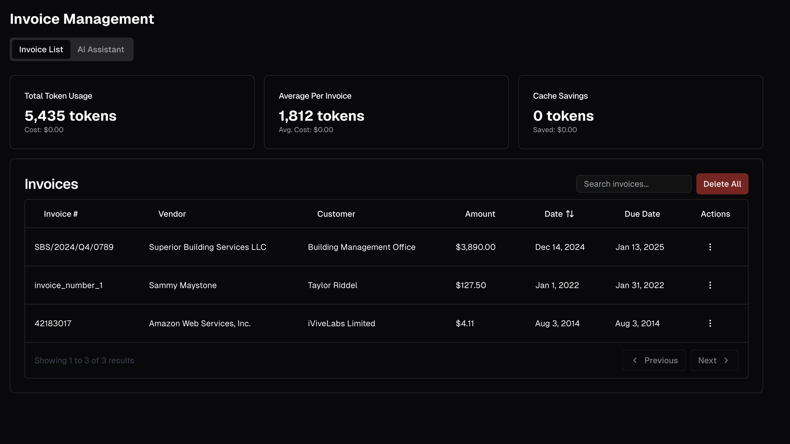
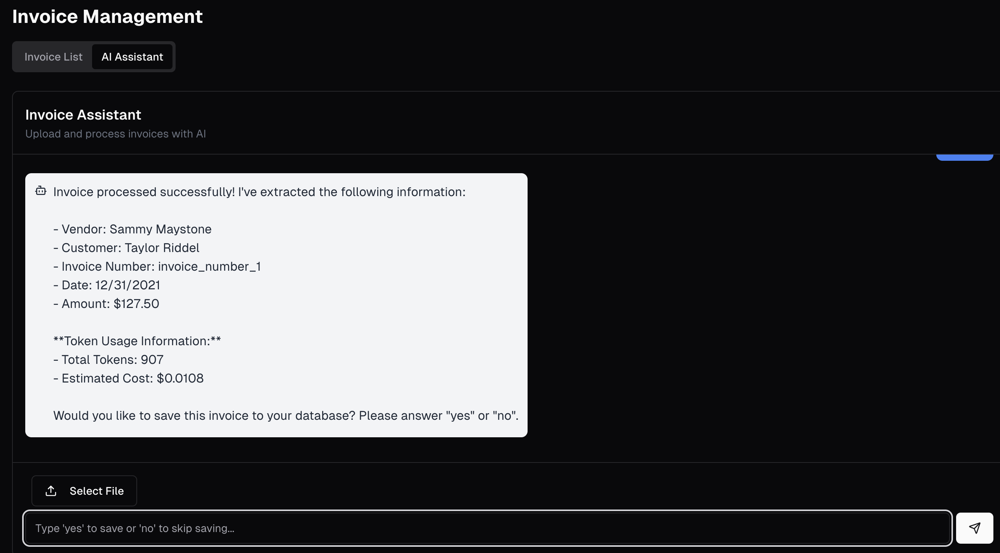
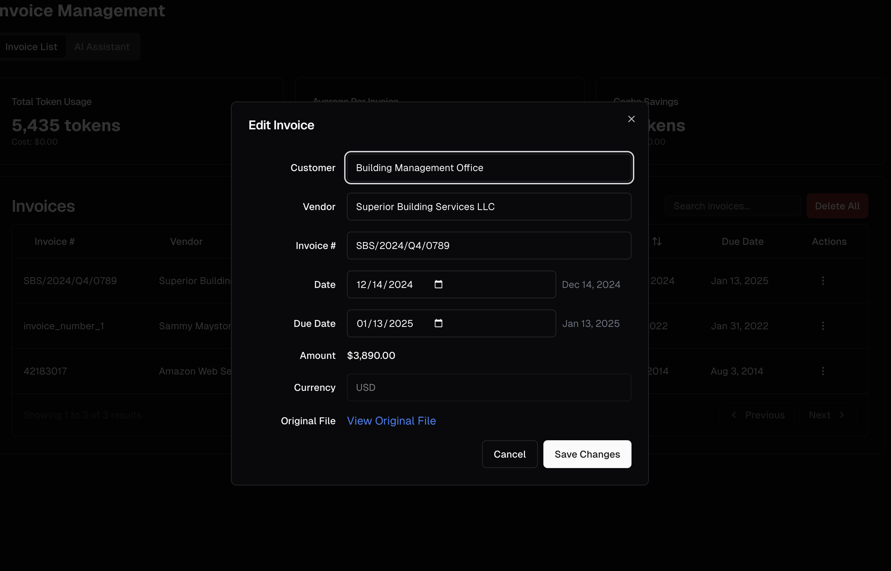
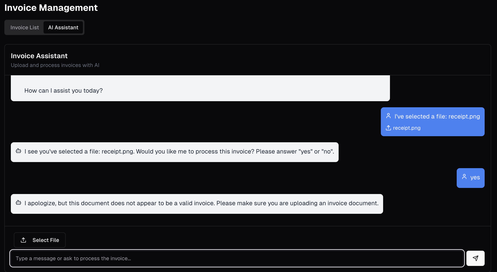

# Invoice Management System

A modern web application for managing invoices with AI-powered processing capabilities. This system allows users to upload, view, edit, and manage invoices with advanced features like automatic data extraction and intelligent processing.



## Key Features

- **Invoice Upload & Processing**
  - Upload PDF and image invoices
  - AI-powered extraction of invoice details (customer name, vendor, amount, dates, etc.)
  - Automatic data validation and error handling
  
  

- **Invoice Management**
  - View all invoices in a responsive, paginated table
  - Edit invoice details with a user-friendly interface
  - Delete invoices with confirmation
  
  

- **Advanced Table Features**
  - Sort by any column (invoice number, date, amount, etc.)
  - Search functionality to quickly find specific invoices
  - Pagination with customizable page size
  - Responsive design for all device sizes

- **Data Visualization**
  - View token usage statistics for AI processing
  - Track processing costs and efficiency

- **Error Handling**
  - Intelligent detection of non-invoice documents
  - Clear error messages and recovery options
  
  

## Technical Features

- [Next.js](https://nextjs.org) App Router
  - Advanced routing for seamless navigation and performance
  - React Server Components (RSCs) and Server Actions for server-side rendering and increased performance
- [AI SDK](https://sdk.vercel.ai/docs)
  - Unified API for generating text, structured objects, and tool calls with LLMs
  - Hooks for building dynamic chat and generative user interfaces
  - Supports OpenAI (default), Anthropic, Cohere, and other model providers
- [shadcn/ui](https://ui.shadcn.com)
  - Styling with [Tailwind CSS](https://tailwindcss.com)
  - Component primitives from [Radix UI](https://radix-ui.com) for accessibility and flexibility
- [Drizzle ORM](https://orm.drizzle.team)
  - Type-safe database operations
  - SQLite database for easy setup and development

## Model Providers

This template ships with OpenAI `gpt-4o` as the default. However, with the [AI SDK](https://sdk.vercel.ai/docs), you can switch LLM providers to [OpenAI](https://openai.com), [Anthropic](https://anthropic.com), [Cohere](https://cohere.com/), and [many more](https://sdk.vercel.ai/providers/ai-sdk-providers) with just a few lines of code.

## Running locally

You will need to use the environment variables [defined in `.env.example`](.env.example) to run the Invoice Management System. 

```bash
pnpm install
pnpm db:migrate
pnpm dev
```

Your app should now be running on [localhost:3000](http://localhost:3000/).
